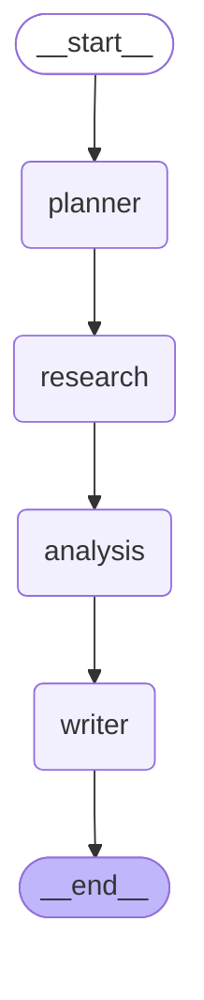

```mermaid
---
config:
  flowchart:
    curve: linear
---
graph TD;
	__start__([<p>__start__</p>]):::first
	planner(planner)
	research(research)
	analysis(analysis)
	writer(writer)
	__end__([<p>__end__</p>]):::last
	__start__ --> planner;
	analysis --> writer;
	planner --> research;
	research --> analysis;
	writer --> __end__;
	classDef default fill:#f2f0ff,line-height:1.2
	classDef first fill-opacity:0
	classDef last fill:#bfb6fc

```